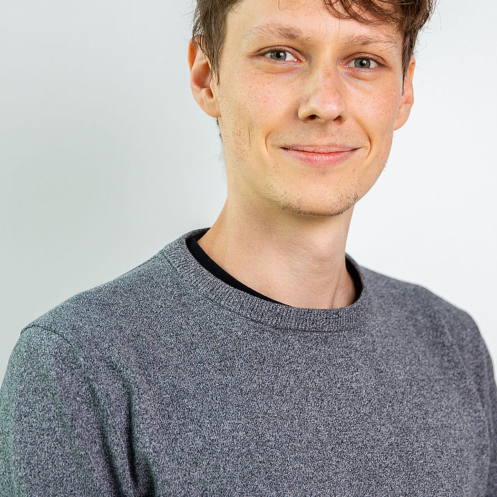
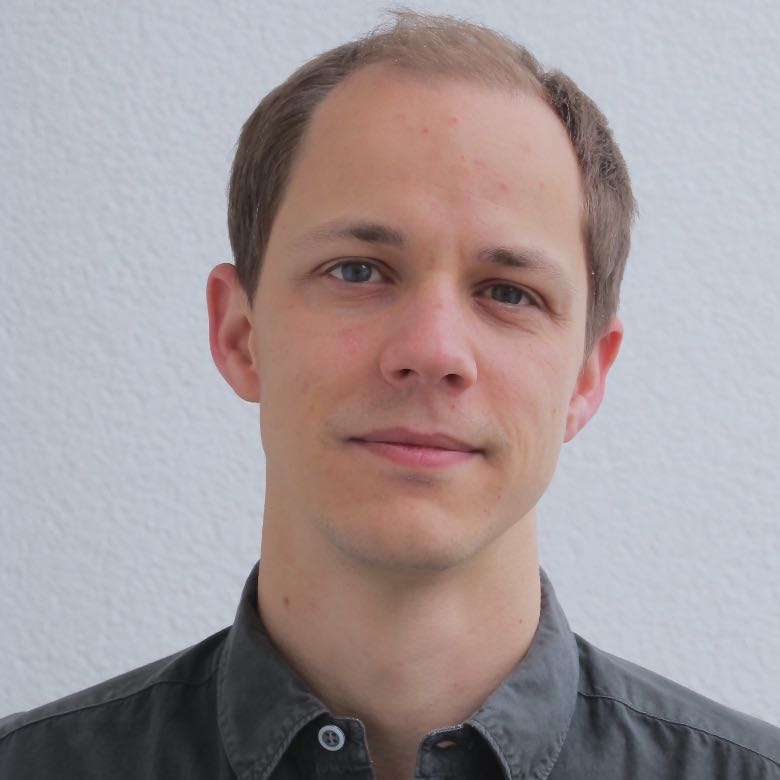

  
[Philipp Baumeister](https://philippbaumeister.github.io/) - PhD student \
*Interior structure and evolution of sub-Neptunian exoplanets* \

  
[Siddhant Agarwal](https://www.researchgate.net/profile/Siddhant-Agarwal-3) - PhD student \
*Interior evolution of terrestrial planets and machine learning* \

  
Falko Schulz - PhD student \
*Non-linear rheologies and mantle dynamics* \

## Former group members:
[Vojtech Patocka](http://geo.mff.cuni.cz/~patocka/)  (2018-2020) - PostDoc \
Maxime Maurice (2015-2020) - PhD student \
[Athanasia Nikolaou](https://www.researchgate.net/profile/Athanasia_Nikolaou) (2015-2019) - PhD student \
Oliver Henke-Seemann (2019) - Bachelor student \
Alexandre Gallot (2019) - Master student \
[Dennis Höning](http://www.dhoening.de/) (2016-2018) - PostDoc \
[Sebastiano Padovan](https://www.researchgate.net/profile/Sebastiano_Padovan) (2015-2017) - PostDoc \
Sebastian Prinz (2014) - Master student \
Magdalena Haselsteiner (2014) - Bachelor student
