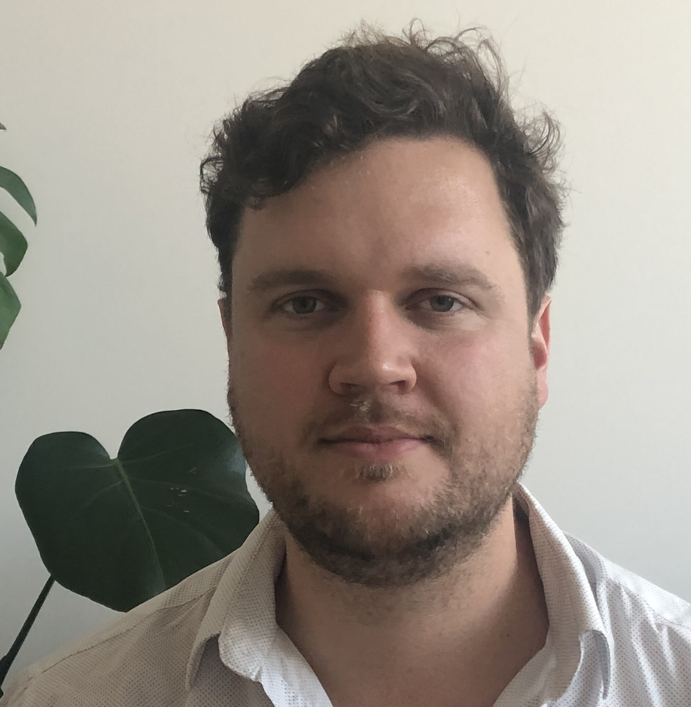
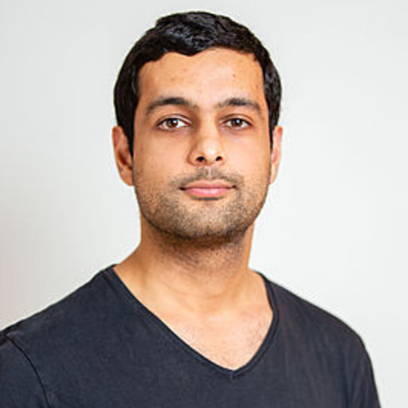

  
[**Valentin Bonnet Gibet**](https://sites.google.com/view/valentin-bonnet-gibet/home) - *PostDoc* \
*Long-term coupled evolution of Earth's mantle and core* \
[DFG Priority Program *DeepDyn*](https://www.geo.lmu.de/deepdyn/en/)
 

  
[**Siddhant Agarwal**](https://www.researchgate.net/profile/Siddhant-Agarwal-3) - *PostDoc* \
*Physics-based machine learning for mantle convection* \
[BMBF Program *Data competence for early career researchers*](https://www.bildung-forschung.digital/digitalezukunft/de/wissen/Datenkompetenzen/datenkompetenzen_wissenschaftlichen_nachwuchs/Projekte/plages.html?nn=733300)
 

  
**Marina Cano Amoros** - *PhD student* (co-advising with [Nadine Nettelmann](https://www.researchgate.net/profile/Nadine-Nettelmann)) \
*Interior structure and evolution of Uranus and Neptune* \
[DFG Research Unit *Matter under planetary interior conditions*](https://www.for2440.uni-rostock.de/)
 

  
**Aman Mohan** - *MSc student* \
*Thermal and outgassing evolution of rocky exoplanets*

## Former students and postdocs:
Michelle Colantoni (2025) - *MSc* \
[Aleeda Charly](https://www.researchgate.net/profile/Aleeda-Charly-2) (2024-2025) - *MSc* \
[Philipp Baumeister](https://philippbaumeister.github.io/) (2017-2023) - *MSc and PhD* \
[Siddhant Agarwal](https://www.researchgate.net/profile/Siddhant-Agarwal-3) (2018-2022) - *PhD* \
Falko Schulz (2017-2021) - *MSc and PhD* \
[Vojtěch Patočka](http://geo.mff.cuni.cz/~patocka/)  (2018-2020) - *PostDoc* \
[Maxime Maurice](https://www.researchgate.net/profile/Maxime-Maurice) (2015-2020) - *MSc and PhD* \
[Shuoran Yu](https://www.researchgate.net/profile/Shuoran-Yu) (2017-2020) - *PhD* (co-advising)\
[Athanasia Nikolaou](https://www.researchgate.net/profile/Athanasia_Nikolaou) (2015-2019) - *PhD* \
[Oliver Henke-Seemann](https://www.geo.fu-berlin.de/en/geol/fachrichtungen/planet/projects/geodyn/staff_noack/Doctoral-candidates/Henke-Seemann/index.html) (2019) - *BSc* \
Alexandre Gallot (2019) - *MSc* \
[Dennis Höning](http://www.dhoening.de/) (2016-2018) - *PostDoc* \
[Sebastiano Padovan](https://www.researchgate.net/profile/Sebastiano_Padovan) (2015-2017) - *PostDoc* \
Sebastian Prinz (2014) - *MSc* \
Magdalena Haselsteiner (2014) - *BSc* \
[Annika Stuke](https://www.researchgate.net/profile/Annika-Stuke) (2013) - *BSc*
