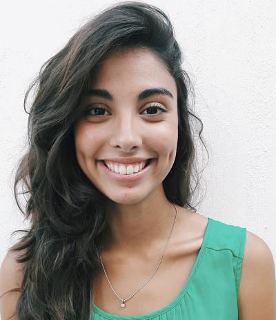

  
[**Siddhant Agarwal**](https://www.researchgate.net/profile/Siddhant-Agarwal-3) - *PostDoc* \
*Physics-based machine learning for mantle convection* 
 

  
[**Philipp Baumeister**](https://philippbaumeister.github.io/) - *PhD student* \
*Interior structure and evolution of low-mass exoplanets* 
 

  
**Marina Cano Amoros** - *PhD student* (co-advising with [Nadine Nettelmann](https://www.researchgate.net/profile/Nadine-Nettelmann)) \
*Interior structure and evolution of Uranus and Neptune* 
 

## Former students and postdocs:
[Siddhant Agarwal](https://www.researchgate.net/profile/Siddhant-Agarwal-3) (2018-2022) - *PhD* \
Falko Schulz (2017-2021) - *MSc and PhD* \
[Vojtěch Patočka](http://geo.mff.cuni.cz/~patocka/)  (2018-2020) - *PostDoc* \
[Maxime Maurice](https://www.researchgate.net/profile/Maxime-Maurice) (2015-2020) - *MSc and PhD* \
[Shuoran Yu](https://www.researchgate.net/profile/Shuoran-Yu) (2017-2020) - *PhD* (co-advising)\
[Athanasia Nikolaou](https://www.researchgate.net/profile/Athanasia_Nikolaou) (2015-2019) - *PhD* \
Oliver Henke-Seemann (2019) - *BSc* \
Alexandre Gallot (2019) - *MSc* \
[Dennis Höning](http://www.dhoening.de/) (2016-2018) - *PostDoc* \
[Sebastiano Padovan](https://www.researchgate.net/profile/Sebastiano_Padovan) (2015-2017) - *PostDoc* \
Sebastian Prinz (2014) - *MSc* \
Magdalena Haselsteiner (2014) - *BSc* \
Annika Stuke (2013) - *BSc*
