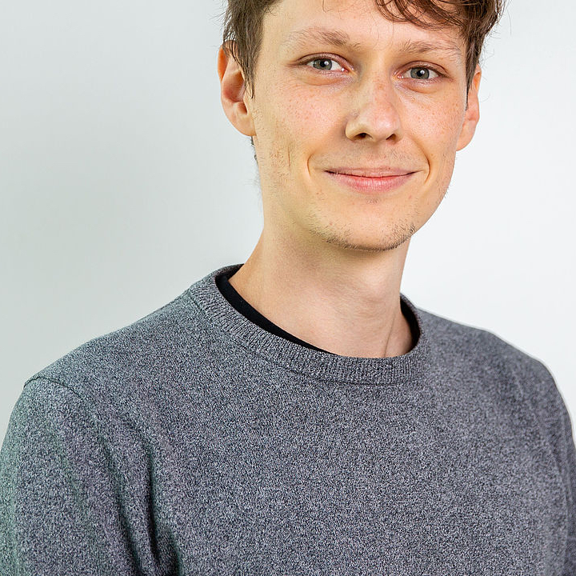

  
[Philipp Baumeister](https://philippbaumeister.github.io/) - *PhD student* \
*Interior structure and evolution of sub-Neptunian exoplanets* 
 

## Former group members:
[Siddhant Agarwal](https://www.researchgate.net/profile/Siddhant-Agarwal-3) (2018-2022) - *PhD student* \
Falko Schulz (2017-2021) - *PhD student* \
[Vojtěch Patočka](http://geo.mff.cuni.cz/~patocka/)  (2018-2020) - *PostDoc* \
Maxime Maurice (2015-2020) - *Master and PhD student* \
[Athanasia Nikolaou](https://www.researchgate.net/profile/Athanasia_Nikolaou) (2015-2019) - *PhD student* \
Oliver Henke-Seemann (2019) - *Bachelor student* \
Alexandre Gallot (2019) - *Master student* \
[Dennis Höning](http://www.dhoening.de/) (2016-2018) - *PostDoc* \
[Sebastiano Padovan](https://www.researchgate.net/profile/Sebastiano_Padovan) (2015-2017) - *PostDoc* \
Sebastian Prinz (2014) - *Master student* \
Magdalena Haselsteiner (2014) - *Bachelor student*
